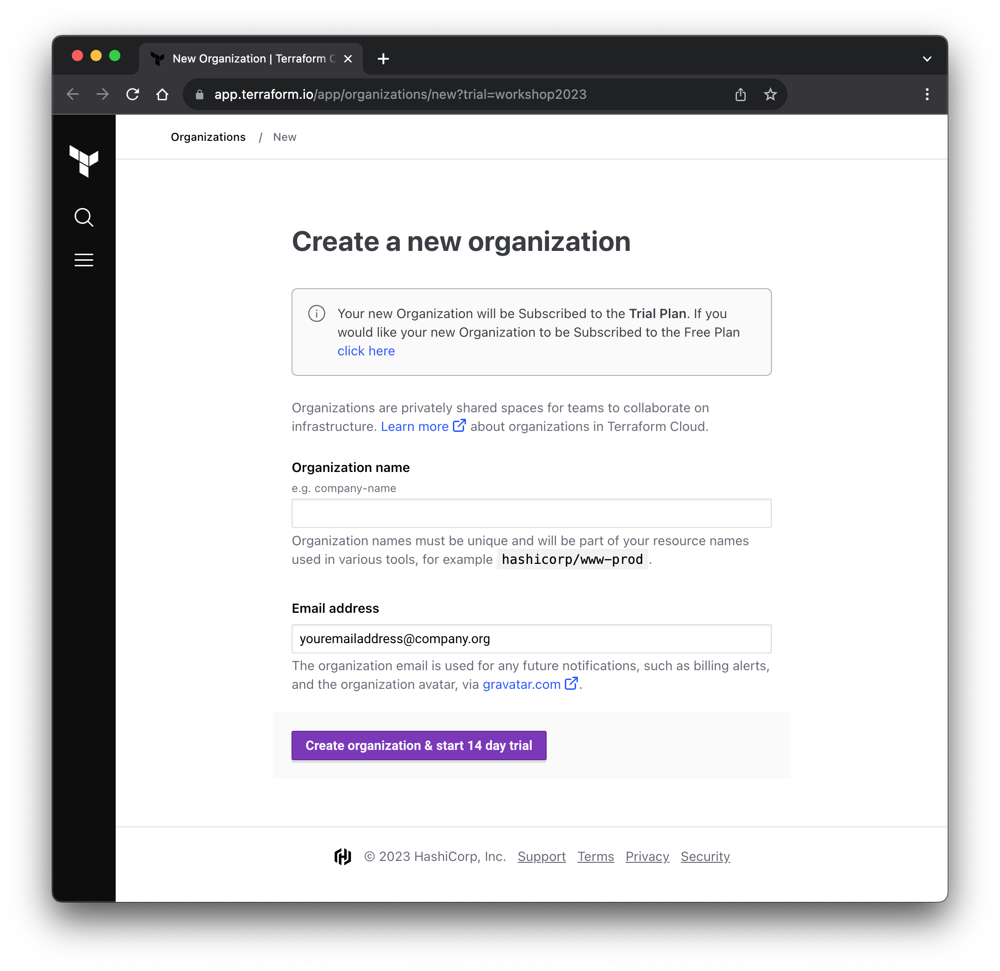

Terraform Cloud Setup
===
1. Sign up for a free Terraform Cloud account:

  - Go to the [Sign-in page](https://portal.cloud.hashicorp.com/sign-in) and create a new account

  - If you already have an account, sign in with your existing credentials

2. Create a new Terraform Cloud Organization

  - Navigate to the [Create a new organization](https://app.terraform.io/app/organizations/new?trial=workshop2023) page and create a Terraform Cloud Organization for this workshop

  - Use the `Create organization & start 14 day trial` button to enable Team and Governance features in your organization. Please see reference below.

Workspace Configuration
===

1. Create a new workspace

   - Select the "CLI-driven workflow" panel, type **hashicat-aws** as the workspace name, enter a description such as "HashiCat for AWS", and click "Create workspace"

---

No really...you *must* name your workspace **hashicat-aws**. If you don't the exercises will break. Do not attempt to name it something else.

**Note:** If you already have a **hashicat-aws** workspace, please delete the workspace by selecting the workspace-level **Settings >> Destruction and Deletion** menu, clicking the **Delete from Terraform Cloud** button, typing **hashicat-aws** to confirm, and then clicking the "Delete workspace" button. Then re-create it as above. Doing this avoids possible problems with mis-matched state versions when executing local runs after having executed remote runs. This could happen if you already played this track in the past.

---

4. Set the Terraform Version

   DO NOT SKIP THE NEXT STEPS:

   - Run `terraform version` on the "Shell" tab and then set the **Terraform Version** to match on the workspace's **Settings >> General** settings page.

   - Also, change the **Execution Mode** to **Local**.

   - Be sure to save your settings by clicking the "Save settings" button at the bottom of the page! This will allow us to run Terraform commands from our workstation with local variables.

---

Before you click the **Check** button, did you change your Execution Mode to Local? This is an easy step to miss so we mention it twice.